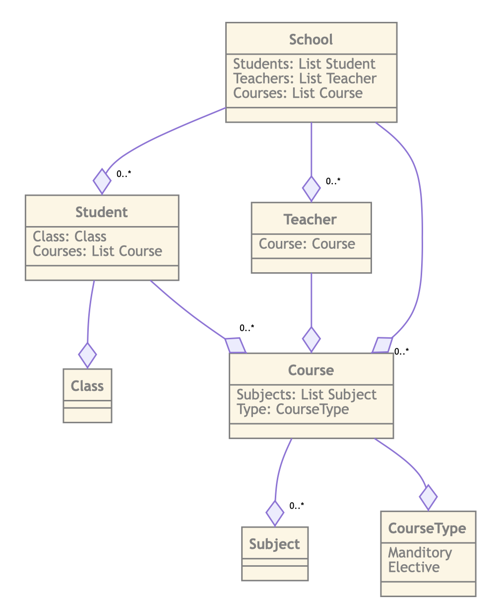

<style>
pre {
  white-space: pre-wrap!important;
}
</style>

# Common Use Cases

This chapter will focus on solving common use cases when modeling your information. Allong the way
we'll look at how to evolve a model form a purely logical data model to an implementation model.

## Conceptual models

Conceptual models are models which represent a high level description of the business needs. It
revolves around describing the main concepts and the main relationships. When you read documentation
on modeling people mostly refer to modeling as something you do to describe databases and their
structures. ZDragon is different. ZDragon allows you to conceptually model your informational domain
through the entities and the definitions.

Within ZDragon you would start by describing the main entities and their relationships. Imagine we
are modeling a School and it's processes.

> Note: The text used in the examples is mostly taken from wikipedia.

The next block of ZDragon describes three

```
# School Model

This model describes the models used in the School Domain.

## School

A school is an educational institution designed to provide learning spaces and learning environments for the teaching of students (or "pupils") under the direction of teachers. Most countries have systems of formal education, which is commonly compulsory. In these systems, students progress through a series of schools. The names for these schools vary by country (discussed in the Regional section below) but generally include primary school for young children and secondary school for teenagers who have completed primary education. An institution where higher education is taught, is commonly called a university college or university, but these higher education institutions are usually not compulsory.

[link](https://en.wikipedia.org/wiki/School)

type School

## Student

A student is primarily a person enrolled in a school or other educational institution who attends classes in a course to attain the appropriate level of mastery of a subject under the guidance of an instructor and who devotes time outside class to do whatever activities the instructor assigns that are necessary either for class preparation or to submit evidence of progress towards that mastery. In the broader sense, a student is anyone who applies themselves to the intensive intellectual engagement with some matter necessary to master it as part of some practical affair in which such mastery is basic or decisive.

type Student

## Teacher

A teacher (also called a school teacher or, in some contexts, an educator) is a person who helps students to acquire knowledge or competence.

type Teacher
```

> While looking at how ZDragon works we will encounter [markdown](https://commonmark.org). Markdown
> is a way to describe document without focussing on the layout. This idea of document processing,
> especially for technical documents is really old, dating back to typesetting ideas like LaTeX.

There are a few things to notice:

- Use Markdown to describe each element.
- Do not compilcate your designs and clutter your models with fields.
- Do not describe the relations yet. Start with simple type definitions and let your model evolve.

## Evolving your information

Now that we have definitions of our core concepts we can start dicecting the text we've written to
figure out the "Peripherals". There are many ways of going about finding these entities. The best
idea, in our opinion, is doing interviews with subject matter experts and distilling the most used
_nouns_. We recommend making the most used nouns bold so that they stick out in text.

> Markdown: surrounding a selection of words with two '\*\*' will make the selection **bold**.

For example, in the Teacher section we would mark it up like:

```
## Teacher

A teacher (also called a \*\*school\*\* \*\*teacher\*\* or, in some contexts, an educator) is a **person** who helps \*\*students\*\* to acquire knowledge or competence.

type Teacher
```

As you can see we've ignored terms like _educator_, _knowledge_ and _competence_. Try and keep the
number of entites you want to describe as small as possible. After parsing all of the text and
taking the most important nouns out of the text we'll end up with something like:

```
# School Model

This model describes the models used in the School Domain.

## School

A school is an educational institution designed to provide learning spaces and learning environments for the teaching of **students** (or "pupils") under the direction of **teachers**. Most countries have systems of formal education, which is commonly compulsory. In these systems, students progress through a series of schools. The names for these schools vary by country (discussed in the Regional section below) but generally include primary school for young children and secondary school for teenagers who have completed primary education. An institution where higher education is taught, is commonly called a university college or university, but these higher education institutions are usually not compulsory.

[link](https://en.wikipedia.org/wiki/School)

type School

## Student

A **student** is primarily a **person** enrolled in a school or other educational institution who attends **classes** in a **course** to attain the appropriate level of mastery of a **subject** under the guidance of an instructor and who devotes time outside class to do whatever activities the instructor assigns that are necessary either for **class** preparation or to submit evidence of progress towards that mastery. In the broader sense, a **student** is anyone who applies themselves to the intensive intellectual engagement with some matter necessary to master it as part of some practical affair in which such mastery is basic or decisive.

type Student

## Teacher

A teacher (also called a school teacher or, in some contexts, an educator) is a person who helps students to acquire knowledge or competence.

type Teacher

## Class

A grouping of students taking one or more courses together.

type Class

## Subject

A general categorization of ideas based on common criteria which are of import to students taking  course.

type Subject

## Course

Courses are time-limited blocks of education, lasting anywhere between several weeks to several months. They can either be compulsory material or "elective". An elective is usually not a required course, but there are a certain number of non-specific electives that are required for certain majors.

type Course

```

## Adding Cardinality

Now that we have the main components of our conceptional model we can start thinking about the next
phase of our model, the cardinality.

> Cardinality: the cardinality or fundamental principle of one data aspect with respect to another
> is a critical feature. The relationship of one to the other must be precise and exact between each
> other in order to explain how each aspect links together.

In ZDragon the cardinality, or "how things relate to each other", is described by relating the
entities to each other as fields.

When we read our documentation we see multiple of these relationships:

- A **School** has multiple **Students**
- A **School** has multiple **Teachers**
- A **School** has multiple **Courses**
- A **Course** consists of multiple **Subjects**
- A **Course** is either **Manditory** or **Elective**
- A **Student** attends **Courses**
- A **Student** is in a **Class**
- A **Teacher** gives one **Course**

There are more relations which can be distilled from the text, but let's keep it at these and see
how we can describe these relations (We've taken the liberty to remove the text from the example,
the final result will be linked to at teh end of the tutorial):

```
type School =
    Students: List Student;
    Teachers: List Teacher;
    Courses: List Course;

type Course =
    Subjects: List Subject;
    Type: CourseType;

choice CourseType =
    | "Manditory"
    | "Elective"

type Student =
    Class: Class;
    Courses: List Course;

type Teacher =
    Course: Course;
```

After creating the relationships between the different models we end up with something we call a
**logical data model**.

<div style="width: 300px">

</div>

[final result](./assets/School.car)
