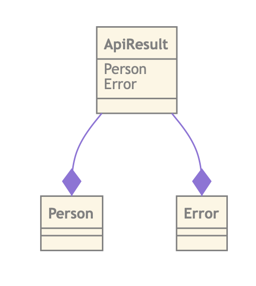

# The language

ZDragon models are written in a language called `car-lang`. This is a combination of `markdown` and
a custom language. You can use this language to model your data and your processes.

It's always good to get the terminology right. ZDragon is the tool, this tool has a CLI and can
build/watch and serve your content. ZDragon also parses your `car-lang` code and transpiles it to
HTML, XSDs and JSON schemas.

## Types

Types are the bread and butter of ZDragon and explain how certain data structures should look. Type
are easily created, like so:

```
type Person
```

This is a simple type and for all intents and purposes this is all you will need to define types.
Because ZDragon is a language which compiles to different formats we can start the web server and
look at the resulting web page. The page will contain a diagram (rendered in
[Mermaidjs](https://mermaidjs.github.io/#/)) and a table describing the type.


You can add fields to your type:

```
type Person =
    FirstName: String;
    LastName: String;
```

`car-lang` is an indentation based language but with terminal statements `;`. What this means is
that `car-lang` sometimes needs you to end your sentences with a `;` and sometimes, mostly with root
objects, you do not need to.

`car-lang`'s entire purpose is to be a frictionless as possible. It tries to get out of your way
when you are declaring your intentions. I like to think of `car-lang` as an intention based
language. Let's break it down:

`FirstName: String;`

Really can't be broken up into smaller parts. We cannot remove the `:` because where would the name
end and the type begin?

### Relationships

ZDragon is smart enough to recognize relationships between entities.

```
type Person =
    FirstName: String;
    LastName: String;
    Address: Address;

type Address =
    Street: String;
    HouseNumber: Number;
```


### Cardinality

```
type Person =
    FirstName: String;
    LastName: String;
    Address: List Address;

type Address =
    Street: String;
    HouseNumber: Number;
```


## Enumerations

Enumerations are tagged union types. This means that if you have, for example, an enum of strings
you could potentially have endless combinations. An enumeration reduces this posible solution space.

in `car-lang` you can write an enumeration as a choice:

```
choice City =
    | "London"
    | "New York"
    | "Amsterdam"
```

Notice the vertical bar symbol `|` also known as the `Or` symbol. This symbol represents a choice.
Later when we visit restrictions we will see it's counter, the `And`, `&` symbol.

We can use this choice as the type of a field:

```
type Address =
    Street: String;
    HouseNumber: Number;
    City: City;

choice City =
    | "London"
    | "New York"
    | "Amsterdam"
```

This will restrict the possible values of `Address.City` to London, New York and Amsterdam.

## Renaming Types

Sometimes we need to rename things. Either for convenence or for clearity, in `car-lang` renaming a
type is done by declaring an `alias`.

> A pseudonym or alias is a name that a person or group assumes for a particular purpose, which can
> differ from their first or true name (orthonym).

Imagine we have have names in our models. We do not want to keep writing `String` because
functionally it is a `Name`; but a name is not a `type`, it does not have properties, fields. In
these cases we create an `alias`:

```
alias Name = String;
```

We can now use `Name` instead of `String` when declaring field types:

```
type Person =
    FirstName: Name;
    LastName: Name;
```

There might be an occasion to rename an actual complex type instead of a base type. This, although
frowned upon, is possible in the language:

```
alias Name = String;

type Person =
    FirstName: Name;
    LastName: Name;

alias Useless = Person;
```

Later in this tutorial we will revist the `alias` when we look at generic types and how the type
checker resolves these special templated types. For now the main thing to remember is that an alias
is nothing more than a rename of a type.

## Algebraic Data Types

The last concept in `car-lang` is the concept of an Algebraic Data Type. This is a kind of type
which has a very difficult name and an even more difficult reason for being in the language, but
once we explain the concept it should be clear why it made it into the language!

Imagine doing a web request. This request can either give you a `Person` type or and `Error`. How
would you express that in a language? In `car-lang` we use the `data` keyword and the `Or` operator
to express these kinds of scenarios:

```
data ApiResult =
    | Person
    | Error
```

The cool thing is that you do not need to acually create the types you are referencing. THe compiler
automagically creates these types for you!!

The model looks like:



Let's look at the resulting JSON schema:

```
{
  "$schema": "http://json-schema.org/draft-07/schema#",
  "title": "ApiResult",
  "description": "",
  "references": {
    "Person": {
      "title": "Person",
      "description": "",
      "type": "object"
    },
    "Error": {
      "title": "Error",
      "description": "",
      "type": "object"
    },
    "ApiResult": {
      "$ref": "#"
    }
  },
  "anyOf": [
    {
      "$ref": "#/references/Person"
    },
    {
      "$ref": "#/references/Error"
    }
  ]
}
```

As you can see the types have been created and the structure of the schema looks nice!

Algebraic Data Types or ADTs for short have a lot of merrit but might seem hard to grasp. You will
notice that they are the last types you will reach for when designing a logical data model but once
you get into service models you will use them for almost every result.

## Conclusion

This concludes our introduction of the `car-lang` language. Later in our chapters we'll see how we
can write Markdown to add documentation to our documents. We can also create views, add flow
diagrams and do more wild type things generics but for now this should be enough to get you started
with ZDragon!
