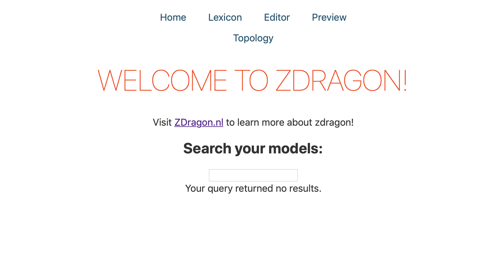
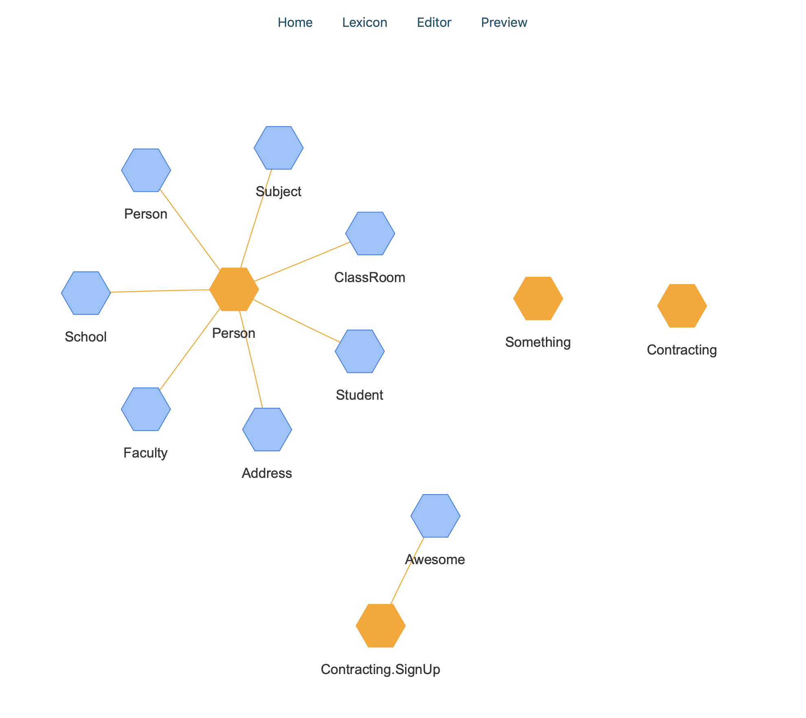

# Running ZDragon

ZDragon is a CLI tool (Command Line Interface). This means that you can't "just click" the
executable...but; for convenience you can "just click" the executable and the watch with serve
command will be executed automatically.

Basically, passing no parameters to the CLI tool will run:

```
ckc watch -s
```

> Keep in mind that the directory in which you "double click" your executable is the directory where
> the project gets created. Please don't do this in your downloads folder.

## The web environment

ZDragon has a web UI to interact with your project. Thsi tradition of supplying your own IDE with a
programming language or system harkens back to the olden days of computer software. We ejoy old
traditions so we rolled out a simple UI.

The `Home` page is the starting point. Here you can search for modules and types and you can
navigate to other parts of the application.



The top navigation buttons allow you to navigate to the sections of the application.

- Home: where you currently are. This is the main page, the home page, the starting page. When you
  are lost, this is where you should return.
- Lexicon: Every data management/documentation tool needs a lexicon. This is where you can explain
  terms and build up a business vocabulary.
- Editor: Where you can edit your documents.
- Preview: Where you can preview your documents.

Some other "pages" you can visit:

### Topology

A topology is the structure of a network, in our case depicted logically. Through the topological
view we want to gain more information about our environment and our models.



## Way of working with ZDragon

Normally we run ZDragon from the command line, but this might be because we love terminals. The
easiest way is to double click the executable. Another way is to add ZDragon (`ckc` or `ckc.exe`) to
your local PATH variable so that you can run it from any directory.
